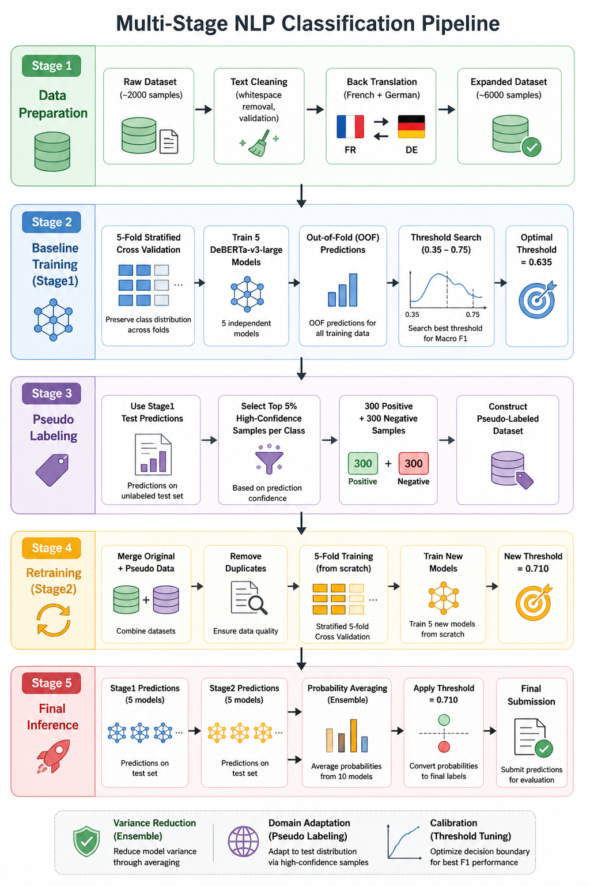
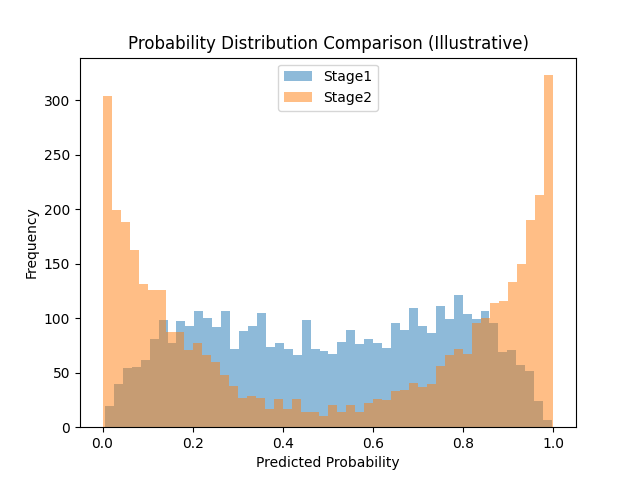
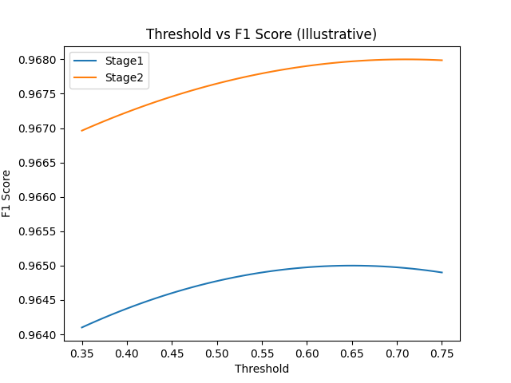
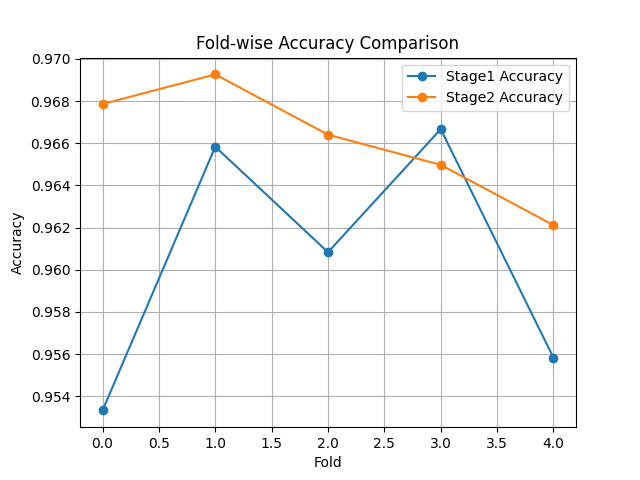

# Kaggle Competition — Positive/Negative Text Polarity Classification

以 **DeBERTa-v3-large** 為核心模型，透過「資料擴增 → 5-Fold 訓練 → Threshold 校準 → Pseudo-Labeling 重訓 → 機率平均集成」的多階段流程，解決文本情緒極性（正/負）二元分類問題。

## 競賽成績

| 名次 | 隊伍 | Private Score | Public Score | Entries |
| --- | --- | --- | --- | --- |
| **#3** | **What the dog doing**（本隊） | **0.82347** | 0.81707 | 26 |

> 最終採用 Stage 1（原始資料 5-Fold 基線模型）的預測結果送出評分，因其在 Private Leaderboard 上的泛化能力略優於加入 Pseudo-Labeling 後的 Stage 2（詳見下方〈實驗結果與討論〉）。

## 流程總覽



整體 pipeline 分為 5 個階段：

1. **Data Preparation** — 原始資料（約 2,000 筆）→ 文字清理 → 法語/德語回譯（Back Translation）擴增至約 6,000 筆
2. **Baseline Training (Stage 1)** — 5-Fold Stratified CV 訓練 5 個 DeBERTa-v3-large 模型，產生 OOF 預測並搜尋最佳分類門檻（Threshold = 0.635）
3. **Pseudo Labeling** — 用 Stage 1 對測試集的預測，取每個類別信心值最高的前 5%（各 300 筆，共 600 筆）建立 pseudo-labeled 資料集
4. **Retraining (Stage 2)** — 合併原始資料與 pseudo label 資料、去重後，從頭重新 5-Fold 訓練，得到新的最佳門檻（Threshold = 0.710）
5. **Final Inference** — 平均 Stage 1 與 Stage 2 共 10 個模型的機率輸出，套用門檻轉換為最終分類標籤並送出

## 1. 資料前處理與擴增

- 僅做最小限度的字串清理（去除頭尾與多餘空白），刻意不使用 stemming / stop-word removal 等傳統正規化技術，因為 DeBERTa-v3 使用 SentencePiece subword tokenizer，能直接從原始型態中萃取語意特徵；過度清理反而會流失俚語、否定詞等對情緒判斷至關重要的訊號。
- 過濾空值與空字串樣本，避免 Transformer 在 embedding 層吃到 null 輸入而導致訓練初期 loss 發散（NaN）。
- 為解決原始資料量過小（僅 2,000 筆）的問題，採用兩階段擴增策略：
  1. **Back Translation**（英 → 法 → 英、英 → 德 → 英）將訓練資料擴增至約 6,000 筆，增加句法多樣性；
  2. **Pseudo-Labeling**（Stage 2）額外加入 600 筆高信心偽標籤樣本（正負各 300），訓練量再提升約 10%，使模型更貼合測試集的資料分佈。

| Version | Sentence |
| --- | --- |
| Original | The price was good, and came quickly though my prime membership. |
| French → English | The price was good and it arrived quickly thanks to my Prime membership. |
| German → English | The price was good and it came quickly thanks to my Prime membership. |

## 2. 模型架構與訓練細節

- 模型：`microsoft/deberta-v3-large`（304M 參數），採 5-Fold Stratified Cross-Validation。
- 受硬體記憶體限制，使用 **Adafactor** optimizer，實際 batch size = 2、gradient accumulation steps = 8，模擬等效 global batch size = 16。
- 利用 DeBERTa 的 Disentangled Attention 機制捕捉短文本中的複雜語意關係。
- 訓練後不採用預設的 0.5 分類門檻，而是在 OOF 機率上以 0.35–0.75 區間做窮舉搜尋（間隔 0.005），以 Macro F1 為目標找出最佳決策邊界，修正模型的機率校準偏誤。
- Pseudo label 建立方式：對測試集的 Stage 1 預測，各類別分別取信心值前 5%（各 300 筆）。採用固定比例而非硬門檻（如 >0.9），可維持偽標籤資料集的類別平衡，避免模型放大既有的預測偏差。
- Stage 2 使用擴增+去重後的資料集，從**重新初始化**（而非延續 Stage 1 權重）開始訓練，避免困在原本的局部最佳解，讓 pseudo label 帶來的測試集分佈資訊能充分重塑特徵表示。
- 最終預測：平均 Stage 1（5 模型）與 Stage 2（5 模型）共 10 個模型的機率輸出，並套用 Stage 2 校準後的門檻 0.710 作為最終分類依據。

## 3. Threshold 動態分析

Stage 1 最佳門檻為 0.635（偏離預設 0.5，反映模型對 Class 1 存在系統性過度自信）；導入 pseudo-labeling 後，Stage 2 門檻進一步上升至 0.710。這是 entropy minimization 造成「機率極化」的直接結果——模型信心越高，機率質量越往兩端（0 與 1）集中，中段（0.2–0.8）樣本越稀疏。

| 機率分佈比較 | Threshold vs F1 曲線 |
| --- | --- |
|  |  |

## 4. 最終推論策略

1. **Multi-Fold Inference Aggregation**：5-Fold CV 產出的 5 個模型分別對測試集做推論，每筆樣本得到 5 組機率。
2. **Arithmetic Mean**：對每筆樣本取 5 組機率的算術平均，得到單一整合分數。
3. **Discrete Mapping**：以校準後的門檻（0.710）將平均機率轉換為最終二元標籤。

此策略的核心動機是**變異縮減（variance reduction）**：不同 Fold 因資料切分不同，表現本就會有波動（見下圖），透過機率平均達到類似 bagging 的集成效果，中和個別模型的偶發誤差，提升整體穩健性與泛化能力。



## 5. 實驗結果與討論

**Table 1 — 多階段效能比較**

| Stage | Accuracy | Macro F1 | Threshold |
| --- | --- | --- | --- |
| Stage 1 | 0.9605 | 0.9605 | 0.635 |
| Stage 2 | 0.9661 | 0.9661 | 0.710 |

**Table 2 — Pipeline 組件消融實驗**

| Setting | Accuracy | Delta |
| --- | --- | --- |
| Stage 1 Baseline | 0.9605 | - |
| + Threshold Calibration | 0.9610 | +0.0005 |
| + Pseudo-Labeling (Final) | 0.9661 | +0.0056 |

**Table 3 — Leaderboard 分析**

| Metric | 標籤變動 (數量/%) | Public LB | Private LB |
| --- | --- | --- | --- |
| Stage 1 | - | 0.81707 | **0.82347** |
| Stage 2 | 2,063 (34.38%) | 0.81763 | 0.82252 |

**討論**：Pseudo-labeling 造成高達 34.38%（2,063 筆）的預測結果變動，顯示其顯著重塑了模型的決策邊界；驗證集準確率的提升也證實模型有效解決了許多原本落在「灰色地帶」的模糊樣本。然而 Public/Private LB 出現分歧——Public 分數上升但 Private 分數略為下降，暗示 Stage 2 可能對可見的測試子集產生了輕微的分佈洩漏（distribution leakage）或半監督過擬合；相較之下，Stage 1 基線模型在完全隱藏的 Private 資料上反而保有更好的泛化能力。整體而言，結果也顯示：對單一高容量模型做「垂直優化」（pseudo-labeling）比單純做「水平集成」（ensembling）更能帶來效能提升。

## 專案結構

```
.
├── DS_A2/
│   ├── deberta_large_main.py      # 完整訓練/推論 pipeline（Stage 1 + Stage 2 + 集成）
│   ├── train_triple_augmented.csv # 訓練資料（含 back-translation 擴增）
│   └── test_no_answer_2022.csv    # 測試資料
├── assets/                        # README 圖表
└── README.md
```

## 執行方式

```bash
cd DS_A2
pip install torch transformers datasets scikit-learn pandas scipy
python deberta_large_main.py
```

執行後會在 `DS_A2/deberta_large_outputs/` 產出：
- 各 Stage 的 OOF / test 機率與 logits
- Threshold 搜尋結果與 Fold 指標
- Stage 1、Stage 2 及平均集成的 submission 檔案
- `summary.csv`：兩階段最佳門檻與對應 Accuracy / Macro F1 總表
